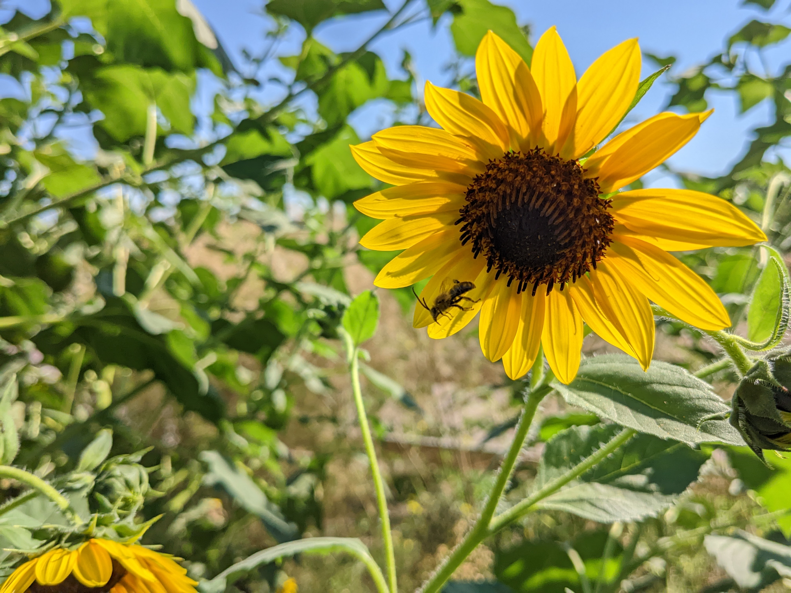

 

  

 

    
  &nbsp;
  
  &nbsp;
  

 

> **What is this repository for?** 
> This repository stores resource files that are frequently used
> for development. For instance, the *Sunflower* image
> below is used as the background picture of the 
> [Augie Gardens website](https://augie-environmental-studies.github.io/gardens/).

## List of Resources
[1.](#sunflower) Sunflower 

<!--
[2.](#2-containerizing-the-website) Containerizing the website

Logo designed by Alexa Lammers
-->

 

### Sunflower

September, 2022 
Prairie Restoration Garden 
Photo credit: Soobin Rho

> I took this photo for my 
> *Seminar in Environmental Philosophy* class,
> which was taught by Dr. David O'Hara. One of
> our assignments was to go to one of the
> campus gardens and make observations
> on a 1x1 meter area of our choice throughout
> the semester. I remember what Dr. O'Hara
> used to say: "do observation with your eyes
> and your hands."
>
> **How did you remove the background?** 
> I used a website called
> [remove.bg](https://www.remove.bg/)
> which uses a machine-learning algorithm
> to remove backgrounds automatically.
> At first, I didn't remove the background, but
> I realized that 
> [Augie Gardens website](https://augie-environmental-studies.github.io/gardens/)
> looks better with the background removed because
> this not only makes it easier to read the text
> on the website, but also emphasizes the sunflower and the bee.

